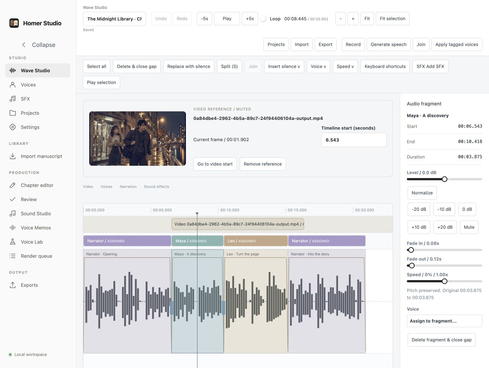
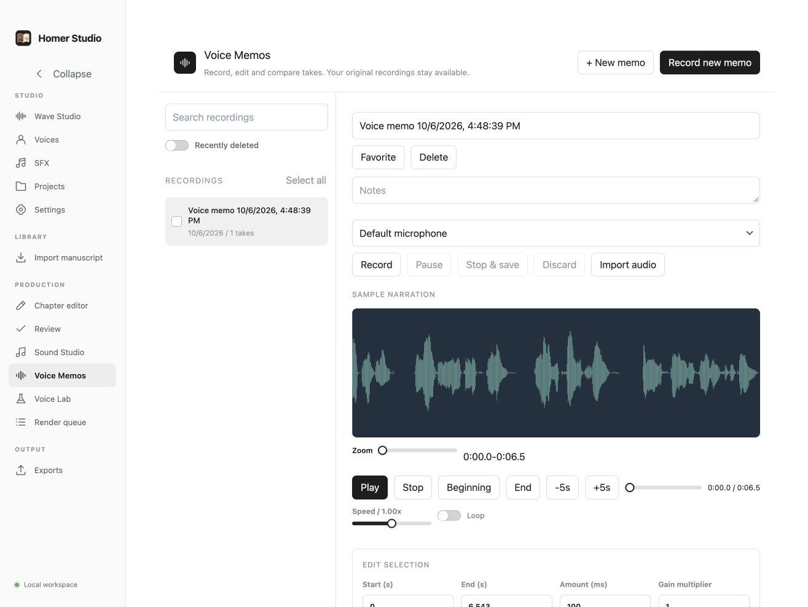

# Homer Studio

English · [Русский](README.ru.md)

Homer Studio is a local-first audio editor and audiobook production studio for Apple Silicon Macs, with a Linux server edition you access through your browser. Record or import narration, mark character voices, generate speech, split and join fragments, mix sound effects, and export WAV or M4A. Manuscript projects support chapter narration, review and audiobook export.

Your desktop files and processing stay on your Mac. In the optional Linux edition, projects, models and processing stay on your own server; browser recordings upload to that server. There are no hosted accounts or analytics.



*Wave Studio with an isolated demo narration and a muted video reference: colored voice assignments, selectable fragments and audio controls. Assigned tags identify the intended voice; generate a tagged voice to change its sound.*

## Editing workflows in v0.3.0

- **Wave Studio:** record or import audio, generate speech with a chosen voice, split/join passages, assign colored voice tags and preview conversions before accepting them. Completed passages are marked and skipped on later conversion runs. Mix overlapping sound effects, adjust gain/fades/speed, normalize and export WAV or M4A. Imported video is a muted synchronization reference with its own timeline placement.
- **Portable projects:** Projects provides search, automatic saving, recently deleted recovery, permanent cleanup and desktop Finder access. Export a `.wavehs` archive with its audio, video and voice references; open it from the file menu, drop it into Wave Studio or pass it to the desktop executable. Restoring a deleted project reloads its actual saved contents before further saving or export.
- **Voice Memos:** searchable recordings and bulk delete/restore, live microphone level history, waveform selection, clearly outlined editing buttons, undo/redo, retakes and conversion/cleanup controls. Save a selection as another memo, record a replacement, open the selected audio in Wave Studio or export it.
- **Navigation and feedback:** shared screen icons, black switches, aligned controls, dismissible notifications that expire automatically, and dialogs with Escape and a common close button. Wave Studio's Keyboard shortcuts button lists playback, fragment navigation and selection shortcuts.
- **Waveform loading:** decoded waveform pyramids remain cached on disk and invalidate when source files change. Each renderer editor keeps up to 120 recent peak windows in memory across screen changes, evicting the least recently viewed windows; full audio is not stored in this visual cache.



*Voice Memos using a disposable sample recording. Optional conversion engines require explicit local setup.*

## Downloads and requirements

Get the [latest release](https://github.com/gubnota/homer_studio/releases/latest). Each new release receives a higher version number.

### macOS

- Apple Silicon (aarch64) Mac running macOS 13 or later
- Download the **aarch64 DMG**; macOS releases publish the DMG only
- FFmpeg and FFprobe, for example `brew install ffmpeg`
- For neural voices: explicitly install the Python runtime and model checkpoints in Settings
- For microphone recording: allow Homer Studio under System Settings → Privacy & Security → Microphone

### Linux browser server

- Linux x86_64; Ubuntu 22.04 or newer
- Download and extract the **Linux application bundle** (`homer-studio-<version>-linux-x86_64.tar.gz`): server executable, browser editor, workers, sound assets and launcher
- FFmpeg, FFprobe, Python 3.10 and venv support: `sudo apt install ffmpeg python3.10 python3.10-venv`
- A modern browser and the server access token; use localhost through SSH forwarding or HTTPS for microphone recording
- Optional GPU acceleration: NVIDIA driver and compatible CUDA-enabled PyTorch; container users also need Docker, Compose and NVIDIA Container Toolkit
- Install neural runtimes and model checkpoints explicitly in Settings; model weights are not bundled

See [Linux installation, browser access and GPU setup](docs/LINUX_SERVER.md). The Linux edition runs on your server and serves the editor in your browser.

### Building from source

Node.js 22, npm and the stable Rust toolchain are required in addition to the platform requirements above. macOS builds require the Apple Silicon Rust target; Linux builds require `build-essential`, `pkg-config` and `libssl-dev`.

## Run from source

```sh
npm ci
npm run dev
```

Create a project in a folder you control, then choose, drop, or paste a TXT or Markdown manuscript. Homer Studio stores a readable `project.json` manifest and generated files inside that project folder.

## Local tool locations

Open **Settings** to see each tool's detected and configured location. Homer Studio checks the app environment and common Apple Silicon locations including `/opt/homebrew/bin`, `/usr/local/bin`, `~/.local/bin`, `~/homebrew/bin`, and `~/local/homebrew/bin`.

If a tool still shows **Not found**, enter its full path or use **Choose**. When automatic discovery succeeds, **Use detected path** saves that location. FFmpeg and FFprobe are required for narration and export. llama.cpp and Ollama are optional text-processing providers.

Ollama has two separate checks: the CLI location and the local server at the configured loopback URL. A found CLI does not mean the server is running.

## Local text processing

Text processing is optional. Open Settings and choose either:

- **llama.cpp:** install `llama-cli`, download a compatible GGUF model yourself, and select the executable and model paths.
- **Ollama:** install and start Ollama, pull a model, and enter its name. Homer Studio accepts loopback Ollama endpoints only.

Generated text is always presented as a candidate. Accepting it changes narration text while preserving the imported source.

## Narration and export

The Voices screen offers the built-in Chatterbox model voice and custom voices from local reference samples. Create a voice, import a clear 6–20 second spoken recording or record through the microphone, then choose one sample to condition generation. You can keep multiple samples and switch between them; the app does not blend different speakers. Preview before a long narration run. Turbo accepts documented inline tags such as `[sigh]` and `[laugh]`; Original has expression controls instead. Exact word emphasis and SSML are unavailable. Install the Turbo or Original checkpoint and the Chatterbox Python runtime in **Settings**; the app starts the selected worker automatically. See [workers/README.md](workers/README.md).

For a long chapter, open **Manual sections** in Review. Generate individual sections or the remaining ones, preview saved takes, choose a take, and assemble the chapter. Click a spoken cue to seek to that section. After assembly, drag on its waveform to select up to 20 seconds within one section. Record that passage and convert it to the selected custom narrator voice with Original Chatterbox. The replacement has short edge fades and appears as a new, unselected take; listen, choose **Use take**, and reassemble. Choosing the earlier take restores the previous delivery. Generated chapter audio can be exported or deleted from Review. The Render Queue shows progress, errors, and controls for cancelling or clearing finished jobs.

You can also import existing chapter audio. FFmpeg preserves WAV chapter masters and normalizes other chapter media to 48 kHz stereo AAC/M4A and FFprobe measures its real duration.

Approve every current chapter recording before export. Homer Studio rechecks the media, joins it, verifies the final duration, and writes both the M4A and timestamp text file to the project.

## Standalone sounds

Open **Sound Studio** without a project to create English speech or a supported Chatterbox Turbo vocal gesture. Speech uses the selected voice from the searchable voice picker. Each finished clip stays in a separate library and can be played, retried, or exported as WAV or M4A. Sound effects are no longer generated; earlier clips remain in the library. Settings can install Turbo and Original checkpoints and the shared Python runtime on request. See [workers/README.md](workers/README.md) for setup and limitations. Worker addresses are set in **Settings**.

## Voice recording and editing

Voice Memos records lossless microphone audio, keeps originals, and supports waveform selections, retakes, reversible edits, take comparison and WAV/FLAC/M4A/MP3 export. The editor is also available in Review, Sound Studio and Voice Lab. Optional Seed-VC/RVC conversion and DeepFilterNet/Resemble cleanup use explicitly installed isolated environments and local model files. See [Voice production](docs/VOICE_PRODUCTION.md) for setup, workflow and manual verification requirements.

## Checks and packages

```sh
npm run build
cargo test --manifest-path src-tauri/Cargo.toml
npm run test:integration
npm run pack:mac
npm run test:smoke
npm run package:mac
```

The final command builds an Apple Silicon `.app` and verifies the release `.dmg` below `src-tauri/target/release/bundle/`. Local packages are ad-hoc signed for development and direct testing. A public distribution can add an Apple Developer ID signature and notarization later.

GitHub CI repeats the checks on an Apple Silicon macOS runner. Tags matching the package version publish the aarch64 DMG and Linux x86_64 application bundle. The Linux job verifies the shared services and HTTP/media integration before publication.
