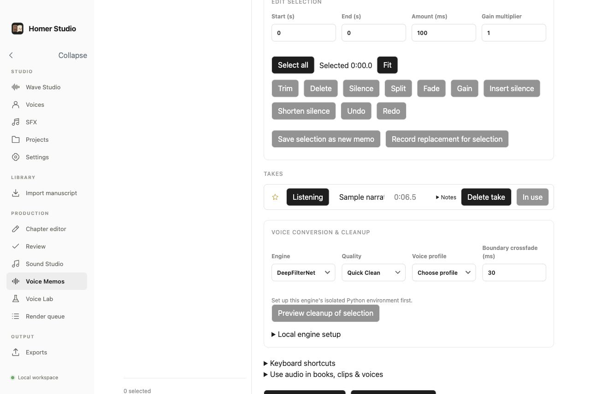

# Homer Studio

[English](README.md) · Русский

Homer Studio — аудиоредактор и студия создания аудиокниг для Mac с Apple Silicon. Версию для Linux можно запустить на собственном сервере и открыть в браузере. Записывайте или импортируйте речь, назначайте голоса персонажам, создавайте речь из текста, разделяйте и соединяйте фрагменты, добавляйте звуковые эффекты и экспортируйте WAV или M4A. Проекты с рукописью поддерживают озвучивание глав, прослушивание и экспорт аудиокниги.

В настольной версии файлы и обработка остаются на вашем Mac. В версии для Linux проекты, модели и обработка находятся на вашем сервере; записи из браузера загружаются на него. Учётные записи в облаке и аналитика отсутствуют.


*Редактор с демонстрационной записью и цветными метками голосов. Метка обозначает назначенный голос; чтобы изменить звучание, запустите преобразование. Импортированное видео служит для синхронизации и по умолчанию воспроизводится без звука.*

## Работа с редактором в v0.3.2

- **Папки проектов:** Save as создаёт читаемый пакет/папку `{name}.wavehs` с манифестом, аудио, образцами и принятыми версиями голосов. Автосохранение повторно использует неизменённые файлы. Открывайте через меню, Finder или перетаскивание. Прежние двоичные архивы поддерживаются; Export portable archive создаёт отдельный сжатый файл для переноса. Видео по умолчанию остаётся внешней ссылкой; Include video добавляет копию. Locate video восстанавливает потерянную ссылку.
- **Экспорт видео:** MP4 объединяет выбранное видео с результатом Wave Studio. Длительность определяется видео; промежутки заполняются тишиной, лишнее аудио обрезается. Экспорт можно отменить; WAV и M4A остаются доступными.
- **Аудио проекта:** записи в Wave Studio, синтез речи и преобразования голосов принадлежат проекту. Записи проекта не отображаются в общем списке Voice Memos; отдельные заметки можно использовать повторно.
- **Voice Memos:** воспроизведение с начала, компактные строки дублей с избранным, именем, длительностью и Use/In use. Left/Right или `< >` переключают дубли; Space запускает с начала или ставит на паузу; `u` выбирает дубль под курсором; Delete запрашивает подтверждение. В списке записей работают Up/Down и Delete. `r` начинает запись; Space останавливает и открывает ввод имени; Enter сохраняет, Escape оставляет стандартное имя.
- **Управление редактором:** ползунки Zoom и View, удержание позиции воспроизведения в видимой области и переход к концу последнего фрагмента клавишей `>`. Цвета голосов видны при выборе. Тёмные кнопки, единые чёрные переключатели и подсказки клавиш дополняют существующий интерфейс.
- **Wave Studio:** запись и импорт аудио, синтез речи выбранным голосом, разделение и объединение фрагментов, цветные метки голосов и прослушивание преобразований до принятия. Готовые фрагменты помечаются и пропускаются при повторном запуске. При смене Alex на John и обратно на Alex восстанавливаются принятый звук Alex и его настройки; новые преобразования используют исходную запись. Доступны Restore original и отмена/повтор. Версии голосов сохраняются с проектом. Звуковые эффекты могут перекрываться; доступны громкость, затухания, скорость, нормализация и экспорт WAV/M4A. Видео используется как видеореференс без звука с отдельной позицией на временной шкале.
- **Интерфейс:** единые значки, чёрные переключатели, выровненные поля, закрываемые уведомления с автоматическим исчезновением и диалоги с Esc и общей кнопкой закрытия. Подсказки горячих клавиш доступны через Keyboard shortcuts в Wave Studio.
- **Быстрая загрузка волновых форм:** результаты декодирования хранятся на диске и обновляются при изменении исходного файла. Редакторы повторно используют до 120 недавних окон волновой формы в памяти между переходами; наименее востребованные удаляются. Полные аудиозаписи в этом визуальном кэше не хранятся.


*Редактор с отдельной демонстрационной записью. Дополнительные движки преобразования требуют явной установки.*



## Загрузка и требования

Скачайте [последний выпуск](https://github.com/gubnota/homer_studio/releases/latest). Номер версии увеличивается при каждом новом выпуске.

### macOS

- Mac с Apple Silicon (aarch64), macOS 13 или новее.
- Установщик **aarch64 DMG**; для macOS публикуется только DMG.
- FFmpeg и FFprobe, например: `brew install ffmpeg`.
- Для нейросетевых голосов явно установите среду Python и модели в **Settings**.
- Для записи разрешите доступ Homer Studio к микрофону: System Settings → Privacy & Security → Microphone.

### Сервер для Linux с доступом через браузер

- Linux x86_64, Ubuntu 22.04 или новее.
- Распакуйте **пакет приложения для Linux** (`homer-studio-<version>-linux-x86_64.tar.gz`): сервер, браузерный редактор, обработчики, звуковые материалы и скрипт запуска.
- FFmpeg, FFprobe, Python 3.10 и поддержка venv: `sudo apt install ffmpeg python3.10 python3.10-venv`.
- Современный браузер и токен доступа к серверу. Для записи с микрофона используйте localhost через SSH-туннель либо HTTPS.
- Для ускорения на GPU: драйвер NVIDIA и совместимый PyTorch с CUDA. При запуске в контейнере также нужны Docker, Compose и NVIDIA Container Toolkit.
- Среды для нейросетей и модели устанавливаются явно в **Settings**; веса моделей не входят в пакет.

Подробнее: [установка Linux, доступ через браузер и настройка GPU](docs/LINUX_SERVER.md). Редактор открывается в браузере, а обработка выполняется на вашем сервере.

### Сборка и запуск из исходного кода

На Mac с Apple Silicon установите инструменты Xcode (`xcode-select --install`), Node.js 22, npm, Bun и стабильный Rust с Cargo. Для обработки аудио/видео нужен FFmpeg с FFprobe. Для Linux дополнительно требуются `build-essential`, `pkg-config` и `libssl-dev`.

В корне репозитория установите зависимости из файла блокировки:

```sh
npm ci
```

Запуск приложения для разработки:

```sh
bun run dev
```

Локальная сборка приложения и DMG для установки в Applications:

```sh
bun run package:mac
```

Команда собирает браузерный редактор, приложение Rust и DMG, проверяет ресурсы и подпись. Сборка может занять несколько минут. Результаты:

- Приложение: `src-tauri/target/release/bundle/macos/Homer Studio.app`
- Установщик: `src-tauri/target/release/bundle/dmg/Homer Studio_<version>_aarch64.dmg`

Закройте Homer Studio перед заменой. Откройте новый DMG, перетащите **Homer Studio** в **Applications** и подтвердите **Replace / Заменить**. Можно также скопировать собранный `.app` через Finder. Сборка сама не заменяет установленное приложение. Сохраните папки проектов и данные приложения: замена программы оставляет их доступными. Локальная сборка использует ad-hoc подпись; при первом запуске macOS может потребовать **Open Anyway / Всё равно открыть** в Privacy & Security.

Для проверки типов, запуска тестов и сборки только браузерного редактора выполните `bun run build`. После упаковки проверить запуск можно командой `bun run test:smoke`. Вместо `bun run` для всех команд можно использовать `npm run`. Для Linux см. [инструкции по сборке](docs/LINUX_SERVER.md).

Создайте проект в своей папке и выберите, перетащите или вставьте рукопись TXT либо Markdown. Homer Studio сохраняет читаемый файл `project.json` и созданные материалы в папке проекта.

## Пути к локальным инструментам

В **Settings** отображаются обнаруженные и заданные пути. Приложение проверяет своё окружение и типичные каталоги Apple Silicon: `/opt/homebrew/bin`, `/usr/local/bin`, `~/.local/bin`, `~/homebrew/bin`, `~/local/homebrew/bin`.

Если инструмент помечен **Not found**, укажите полный путь или нажмите **Choose**. Кнопка **Use detected path** сохраняет найденный путь. FFmpeg и FFprobe нужны для озвучивания и экспорта. llama.cpp и Ollama используются только для необязательной обработки текста.

У Ollama отдельно проверяются путь к CLI и сервер по заданному локальному адресу. Обнаружение CLI не означает, что сервер запущен.

## Локальная обработка текста

В Settings можно выбрать:

- **llama.cpp:** самостоятельно установите `llama-cli`, загрузите совместимую GGUF-модель и укажите оба пути.
- **Ollama:** установите и запустите Ollama, загрузите модель и укажите её имя. Поддерживаются только локальные адреса loopback.

Созданный текст предлагается для проверки. Его принятие изменяет текст озвучивания, сохраняя импортированный оригинал.

## Озвучивание и экспорт

Экран **Voices** предлагает встроенный голос Chatterbox и пользовательские голоса на основе локальных образцов. Создайте голос и импортируйте чистую запись речи длительностью 6–20 секунд либо запишите её с микрофона. Выберите один образец для генерации. Можно хранить несколько образцов и переключаться между ними; голоса разных людей не смешиваются. Прослушайте результат перед длинной генерацией.

Turbo поддерживает документированные вставки, например `[sigh]` и `[laugh]`; Original использует настройки выразительности. Точное выделение отдельных слов и SSML недоступны. В **Settings** установите модель Turbo или Original и среду Python для Chatterbox; выбранный обработчик запускается автоматически. Подробнее: [настройка обработчиков](workers/README.md).

Для длинной главы откройте **Manual sections** в Review. Создавайте отдельные разделы или оставшиеся разделы, прослушивайте сохранённые дубли, выбирайте подходящие и собирайте главу. Нажатие на реплику перемещает воспроизведение к нужному разделу.

После сборки выделите на волновой форме до 20 секунд внутри одного раздела. Запишите этот отрывок и преобразуйте его в выбранный голос рассказчика через Original Chatterbox. Результат с короткими плавными переходами появляется как новый дубль. Прослушайте его, выберите **Use take** и соберите главу повторно. Выбор предыдущего дубля возвращает прежнее звучание. Готовую запись главы можно экспортировать или удалить в Review. **Render Queue** показывает прогресс, ошибки и позволяет отменять задания и очищать завершённые.

Можно импортировать уже записанные главы. FFmpeg сохраняет мастер-записи WAV и приводит остальные форматы глав к AAC/M4A, 48 кГц, стерео; FFprobe измеряет фактическую длительность.

Перед экспортом подтвердите текущую запись каждой главы. Приложение повторно проверяет материалы, соединяет их, сверяет итоговую длительность и сохраняет M4A вместе с текстовым файлом временных меток.

## Отдельные звуки

**Sound Studio** работает без проекта: создаёт английскую речь или поддерживаемый вокальный жест Chatterbox Turbo. Для речи используется голос из списка с поиском. Готовые фрагменты хранятся в отдельной библиотеке; их можно прослушивать, создавать повторно и экспортировать в WAV или M4A. Генерация звуковых эффектов отключена; ранее созданные записи остаются доступны.

По вашему запросу Settings устанавливает модели Turbo и Original и общую среду Python. Адреса обработчиков также задаются в Settings. Подробнее об установке и ограничениях: [workers/README.md](workers/README.md).

## Запись и редактирование голоса

**Voice Memos** записывает звук с микрофона без потерь, сохраняет оригиналы и поддерживает выделение на волновой форме, перезапись, обратимые правки, сравнение дублей и экспорт WAV/FLAC/M4A/MP3. Редактор доступен также в Review, Sound Studio и Voice Lab.

Необязательные преобразования Seed-VC/RVC и очистка DeepFilterNet/Resemble используют явно установленные изолированные среды и локальные модели. Подробнее: [работа с голосом](docs/VOICE_PRODUCTION.md).

## Проверки и пакеты

```sh
npm run build
cargo test --manifest-path src-tauri/Cargo.toml
npm run test:integration
npm run pack:mac
npm run test:smoke
npm run package:mac
```

Последняя команда создаёт `.app` для Apple Silicon и проверяет `.dmg` в `src-tauri/target/release/bundle/`. Локальные пакеты имеют подпись ad-hoc для разработки и прямого тестирования. Подпись Apple Developer ID и нотариальное заверение можно добавить отдельно.

GitHub CI повторяет проверки на Mac с Apple Silicon. Теги, совпадающие с версией пакета, публикуют aarch64 DMG и пакет приложения Linux x86_64. Перед публикацией Linux проверяются общие службы и HTTP-интерфейс с обработкой медиа.
